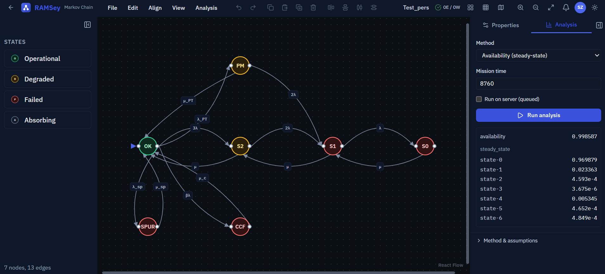

# RAMSey

A modern, web-based, collaborative tool for creating, analyzing, and exporting RAMS (Reliability, Availability, Maintainability, Safety) diagrams.



> The [2-out-of-3 pump station example](examples/markov-2oo3-pump-station.json): three pumps, a common-cause
> failure, a proof test and a spurious trip — solved in the browser for a steady-state availability of 0.9986.

RAMSey replaces legacy desktop tools with a real-time collaborative environment featuring AI-assisted diagram editing, integrated analysis solvers, and publication-quality LaTeX/TikZ export.

## Features

### Diagram Types
- **Markov Chains** — State-transition diagrams with validation
- **Fault Tree Analysis (FTA)** — Logic gates, minimal cut sets, importance measures
- **Event Tree Analysis (ETA)** — Branching outcome probability analysis
- **Reliability Block Diagrams (RBD)** — Series / parallel / k-out-of-n and general (non-series-parallel) networks
- **Bow-Tie Diagrams** — Combined FTA + ETA with barrier management
- **FMEA** — Tabular failure mode analysis with RPN scoring, configurable risk bands, sort/filter by risk, and CSV export

### Integrated Analysis Engine
Analysis is implemented for all five graph diagram types, in a shared engine package, with results that carry provenance (solver name/version, method, numeric metadata, assumptions, warnings):
- **Markov** — steady-state, transient, availability, reliability, MTTF, MTBF/MTTR, failure frequency, sensitivity
- **Fault tree** — minimal cut sets (MOCUS), top-event probability (exact inclusion–exclusion), importance measures (Birnbaum, Fussell-Vesely, RAW, RRW), Monte Carlo, beta-factor common-cause
- **RBD** — reliability/availability over any two-terminal network (minimal path sets + inclusion–exclusion), sensitivity, Monte Carlo
- **Event tree** — consequence probabilities
- **Bow-tie** — top-event and consequence probabilities via barrier propagation
- **Hybrid execution** — analyses run client-side in a Web Worker by default. Deployments that run the optional solver worker can queue them server-side instead, with results persisted; where it is not deployed the option is hidden

### Real-Time Collaboration
- Multi-user simultaneous editing via Yjs (CRDT)
- Live cursors and selection awareness
- Server-persisted shared state, with an audit log of account and project actions
- Guest mode works locally (browser storage) without an account

### AI Assistance
- Natural-language diagram editing via tool calling — nodes and edges appear on the canvas as the reply streams
- A whole AI turn is one undo step, and generation can be stopped mid-reply
- Context-aware Q&A about the current model
- Token-denominated cost ceilings per session, per user and per deployment
- Optional: the tab is hidden unless a provider is configured

### Export
- **LaTeX/TikZ** — compilable standalone document, publication-ready
- **SVG** — scalable vector graphics
- **PNG / JPEG** — configurable resolution
- **CSV** — FMEA worksheet, for spreadsheets
- **JSON** — raw diagram data

### Projects & Teams
- Project-based organization with multiple diagrams per project
- Team workspaces with role-based access (admin / member)
- Per-project sharing with owner / editor / viewer roles
- Link sharing (anyone with the link)

## Tech Stack

| Layer | Technology |
|---|---|
| Frontend | React, TypeScript, Vite, React Flow, Zustand, Tailwind CSS |
| Backend | Node.js, Fastify, TypeScript, Prisma |
| Database | PostgreSQL |
| Cache & queue | Redis (shared rate-limit counters), pg-boss (Postgres-backed analysis job queue) |
| Collaboration | Yjs, y-websocket (custom Fastify sync server) |
| Auth | JWT sessions (httpOnly cookie) + Google OAuth |
| AI | Pluggable LLM provider (Anthropic or any OpenAI-compatible endpoint) with tool calling |
| Analysis | Shared `@ramsey/engine` package (client Web Worker + server solver worker) |
| Export | html-to-image, custom TikZ serializers |
| Infrastructure | Docker, Docker Compose, GitHub Actions |

## Getting Started

### Prerequisites

- Node.js 20.19+ or 22.12+ (required by Vite 8)
- Docker & Docker Compose
- Git

### Setup

```bash
# Clone the repository
git clone https://github.com/szilagyib/RAMSey.git
cd RAMSey

# Copy environment variables
cp .env.example .env

# Start services
docker compose up -d

# Install dependencies
npm install

# Run database migrations
npm run db:migrate

# Start development (backend + frontend)
npm run dev
```

### Testing

```bash
npx vitest run        # engine + backend unit/API + frontend unit tests
npm run test:e2e      # Playwright browser journeys (needs the dev Postgres up)
npm run lint          # eslint (flat config)
npm run typecheck     # tsc across all workspaces
```

### Try an example

Open any diagram, then **File → Import JSON…** and pick one of:

**Markov chains**

- [`markov-redundant-power.json`](examples/markov-redundant-power.json) — a repairable
  redundant-PSU model (all four state types, λ/μ/β rates) ending in an absorbing
  blackout state, so it suits reliability, transient and **MTTF** analysis.
- [`markov-2oo3-pump-station.json`](examples/markov-2oo3-pump-station.json) — a
  2-out-of-3 pump station with common-cause failure, proof-test maintenance and
  spurious trips. No absorbing state, so **steady-state availability and MTBF/MTTR
  converge** (≈0.9986 available, MTBF ≈1780 h) — the metrics an absorbing model
  drives to zero.

**One system, four notations.** The remaining examples are all the *same* emergency
cooling-water system, so you can see what each notation shows and what it hides:

- [`rbd-cooling-water.json`](examples/rbd-cooling-water.json) — two trains with a
  cross-tie, which makes the network **non series-parallel**: it can't be folded by
  series/parallel reduction and is solved from its three minimal path sets.
- [`fault-tree-cooling-loss.json`](examples/fault-tree-cooling-loss.json) — the same
  system backwards. 9 minimal cut sets; importance ranks **station power above pump
  failure despite being 5× less likely**, because power is a single point of failure
  and pumps only matter in pairs.
- [`event-tree-cooling-loss.json`](examples/event-tree-cooling-loss.json) — the same
  system forwards: from the loss, through the barriers, to the consequences.
- [`bow-tie-cooling-loss.json`](examples/bow-tie-cooling-loss.json) — threats, top
  event and consequences in one picture. The left half is the fault tree, the right
  half is the event tree.

### Environment Variables

See [`.env.example`](.env.example) for development configuration and
[`docs/OPERATIONS.md`](docs/OPERATIONS.md) for the full operator reference
(every variable, defaults, AI budgets, secret rotation, backups).

## Project Structure

```
RAMSey/
├── packages/
│   ├── frontend/          # Vite + React SPA
│   ├── backend/           # Fastify API + Yjs collab server + solver worker + auth
│   └── engine/            # Shared analysis engine (ModelIR, solvers)
├── docker/                # Dockerfiles + compose (incl. solver-worker service)
├── docs/                  # Deployment guide (OPERATIONS.md)
├── examples/              # Importable example diagrams
└── e2e/                   # Playwright end-to-end tests
```

## Architecture

```
Browser (Vite SPA)
  ├── React Flow canvas (diagram editing)
  ├── Zustand (state management)
  ├── Yjs (CRDT real-time sync) + awareness (cursors/selection)
  ├── AI Chat Panel (streaming, tool calling — draws on the canvas live)
  └── Client analysis (Web Worker, @ramsey/engine)
          │
          │ WebSocket + REST
          ▼
Server
  ├── Fastify API (orchestrator, rate-limited)
  ├── Yjs WebSocket sync server (collaboration + persistence)
  ├── JWT sessions + Google OAuth, teams & project sharing
  ├── pg-boss job queue (Postgres) → solver worker (separate process, @ramsey/engine)
  ├── PostgreSQL (data, audit log, snapshots, analysis results)
  └── Redis (shared rate-limit counters; fails open when down)
```

Architectural principle: **the API server doesn't perform heavy computation**. Server-side analysis runs in an isolated solver-worker process via the job queue.

## Known limitations

Stated plainly, because a half-built feature that looks finished is worse than a
missing one:

- **PDF export** is not implemented (LaTeX/TikZ, SVG, PNG, JPEG, JSON, CSV are).
- **Version history** is not exposed. Snapshots can be created and listed through
  the API, but there is no UI to browse or restore them, so the menu entry is
  hidden until there is.
- **Notifications are read-only** — the bell lists them; it does not link through
  to what triggered them.
- **OAuth** is Google only.
- **FMEA** computes RPN but not criticality classification. RPN bands are a team
  convention, not a standard (AIAG-VDA replaced them with Action Priority), which
  is why the thresholds are configurable.
- Guest mode is local-only (no offline-first sync).
- Fault-tree probabilities use **MOCUS + inclusion–exclusion** (exact for typical
  sizes), not BDD.
- **Mobile** targets reviewing and building with the AI assistant. The canvas is
  usable but drag-and-drop editing is a desktop gesture; the toolbar collapses
  into an overflow menu on small screens.
- Optional features (AI assistant, server-side analysis) hide themselves when the
  deployment does not configure them — see
  [`docs/OPERATIONS.md`](docs/OPERATIONS.md). The AI assistant needs a provider
  key, and the quality of generated diagrams varies with the model chosen.

## Self-hosting

See [`docs/OPERATIONS.md`](docs/OPERATIONS.md) for the deployment guide:
environment variables, Docker Compose setup, migrations, backups, and
monitoring. A minimal deployment is a single small VPS.

## License

[MIT](LICENSE)
